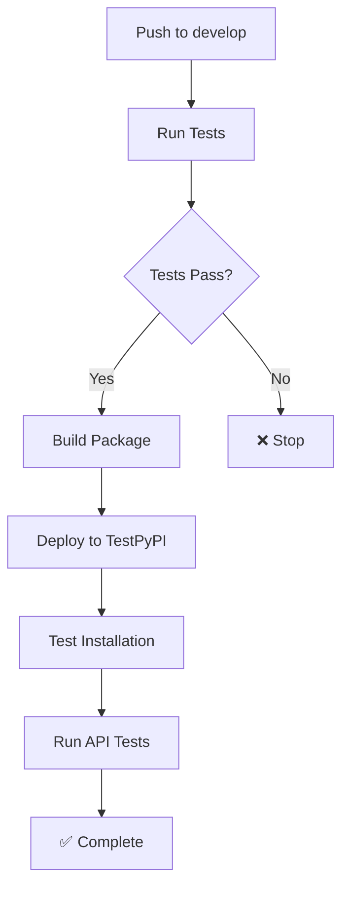
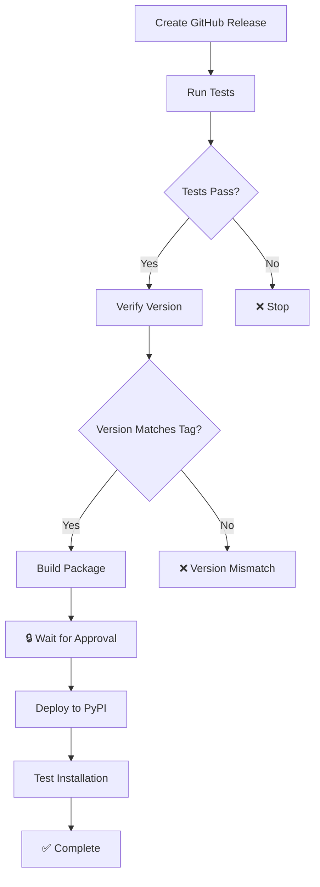

# GitHub Actions Deployment Guide

This guide explains how GitHub Actions handles automated deployments to TestPyPI and PyPI.

## Overview

The repository uses GitHub Actions for continuous integration and automated deployments:

- **TestPyPI**: Auto-deploy on push to `develop` branch for testing
- **PyPI**: Auto-deploy on GitHub release creation for production
- **Security**: Automated security scanning and code quality checks

## Workflow Files

### 1. `.github/workflows/test-and-deploy.yml`

Main CI/CD workflow that handles:

```yaml
on:
  push:
    branches: [ main, develop ]
  pull_request:
    branches: [ main ]
  release:
    types: [ published ]
```

**Jobs**:
- `test`: Multi-Python version testing (3.9-3.12)
- `deploy-testpypi`: Deploy to TestPyPI (develop branch)
- `deploy-pypi`: Deploy to PyPI (releases)
- `api-integration-test`: Test with real APIs

### 2. `.github/workflows/security-scan.yml`

Security-focused workflow:

```yaml
on:
  push:
    branches: [ main, develop ]
  pull_request:
    branches: [ main ]
  schedule:
    - cron: '0 2 * * 1'  # Weekly
```

**Security Tools**:
- Bandit: Static security analysis
- Safety: Vulnerability scanning
- pip-audit: Dependency auditing

## Environment Setup

### GitHub Environments

Create these environments in GitHub (Settings > Environments):

#### 1. `testpypi`
- **Purpose**: TestPyPI deployments
- **Protection**: None (auto-deploy)
- **Secrets**: `TESTPYPI_API_TOKEN`

#### 2. `pypi`  
- **Purpose**: Production PyPI deployments
- **Protection**: Required reviewers, 5-minute wait
- **Secrets**: `PYPI_API_TOKEN`

#### 3. `api-testing`
- **Purpose**: Real API integration tests
- **Protection**: None
- **Secrets**: Provider API keys (optional)

### Required Secrets

Add these secrets to the respective environments:

```bash
# TestPyPI environment
TESTPYPI_API_TOKEN=pypi-...

# PyPI environment  
PYPI_API_TOKEN=pypi-...

# API Testing environment (optional)
OPENAI_API_KEY=sk-...
GOOGLE_API_KEY=AIza...
CLAUDE_API_KEY=sk-ant-...
XAI_API_KEY=xai-...
```

## Deployment Flow

### TestPyPI Deployment (Develop Branch)



**Trigger**: `git push origin develop`

**Process**:
1. Run comprehensive tests on Python 3.9-3.12
2. Build package with `uv build`
3. Deploy to TestPyPI using `pypa/gh-action-pypi-publish`
4. Wait 60s and test installation from TestPyPI
5. Run integration tests with real APIs (if keys available)

### PyPI Deployment (Production Release)



**Trigger**: Create GitHub release with tag `v*`

**Process**:
1. Run comprehensive tests
2. Verify release tag matches package version
3. Build package
4. **Wait for manual approval** (environment protection)
5. Deploy to PyPI
6. Test installation from PyPI

## Creating a Release

### Method 1: GitHub UI (Recommended)

1. Go to repository > **Releases** > **Create a new release**
2. **Tag**: `v0.1.3` (must start with `v`)
3. **Title**: `Release v0.1.3`
4. **Description**: Copy changes from CHANGELOG.md
5. Click **Publish release**

### Method 2: Command Line

```bash
# Update version first
python scripts/bump_version.py 0.1.3

# Commit and push
git add .
git commit -m "Prepare release v0.1.3"
git push origin main

# Create and push tag
git tag v0.1.3
git push origin v0.1.3

# Create release via GitHub CLI
gh release create v0.1.3 --title "Release v0.1.3" --notes-file CHANGELOG.md
```

## Workflow Features

### Multi-Python Testing

Tests run on Python 3.9, 3.10, 3.11, and 3.12:

```yaml
strategy:
  matrix:
    python-version: ["3.9", "3.10", "3.11", "3.12"]
```

### UV Package Manager

Uses UV for fast dependency management:

```yaml
- name: Install uv
  uses: astral-sh/setup-uv@v3
  with:
    enable-cache: true
    cache-dependency-glob: "uv.lock"
```

### Security Integration

Runs security checks but doesn't fail on missing tools:

```yaml
- name: Run security checks (if available)
  run: |
    if uv run bandit --version > /dev/null 2>&1; then
      uv run bandit -r src/ -ll
    else
      echo "Bandit not available, skipping security check"
    fi
  continue-on-error: true
```

### Version Verification

Ensures release tag matches package version:

```yaml
- name: Verify version matches tag
  run: |
    TAG_VERSION=${GITHUB_REF#refs/tags/v}
    PACKAGE_VERSION=$(uv run python -c "import pyaibridge; print(pyaibridge.__version__)")
    if [ "$TAG_VERSION" != "$PACKAGE_VERSION" ]; then
      echo "❌ Tag version ($TAG_VERSION) doesn't match package version ($PACKAGE_VERSION)"
      exit 1
    fi
```

## Monitoring Deployments

### GitHub Actions UI

1. Go to **Actions** tab
2. Select the running workflow
3. Monitor job progress
4. Check logs for errors

### PyPI Verification

```bash
# Check package page
https://pypi.org/project/pyaibridge/

# Test installation
pip install pyaibridge
python -c "import pyaibridge; print(f'v{pyaibridge.__version__}')"
```

### TestPyPI Verification

```bash
# Test installation from TestPyPI
pip install -i https://test.pypi.org/simple/ --extra-index-url https://pypi.org/simple/ pyaibridge

# Verify functionality
python -c "import pyaibridge; print('TestPyPI package works!')"
```

## Troubleshooting

### Common Issues

1. **Tests failing**
   - Check Actions logs for specific failures
   - Fix issues and push again

2. **Version mismatch**
   - Ensure tag version matches package version
   - Update version with `scripts/bump_version.py`

3. **Authentication failed**
   - Check API tokens in environment secrets
   - Verify token permissions on PyPI

4. **Package already exists**
   - Cannot overwrite versions on PyPI
   - Increment version number

5. **Environment approval timeout**
   - Check environment protection rules
   - Approve deployment manually

### Debug Workflow

Enable debug logging by setting repository secret:
```
ACTIONS_STEP_DEBUG=true
```

### Manual Override

If automated deployment fails, deploy manually:

```bash
# Build package
uv build

# Deploy to TestPyPI
uv run twine upload --repository testpypi dist/*

# Deploy to PyPI
uv run twine upload dist/*
```

## Best Practices

### Branch Strategy

- `main`: Production-ready code → PyPI releases
- `develop`: Testing code → TestPyPI deployments
- `feature/*`: Development branches

### Release Process

1. Develop features in feature branches
2. Merge to `develop` → triggers TestPyPI deployment
3. Test TestPyPI package thoroughly
4. Merge to `main` and create release → triggers PyPI deployment

### Security

- Store all secrets in GitHub environment secrets
- Use environment protection rules for production
- Regular security scanning with scheduled workflows
- Monitor package for vulnerabilities

### Monitoring

- Watch GitHub Actions for failed workflows
- Monitor PyPI download statistics
- Check for reported issues or bugs
- Keep dependencies updated